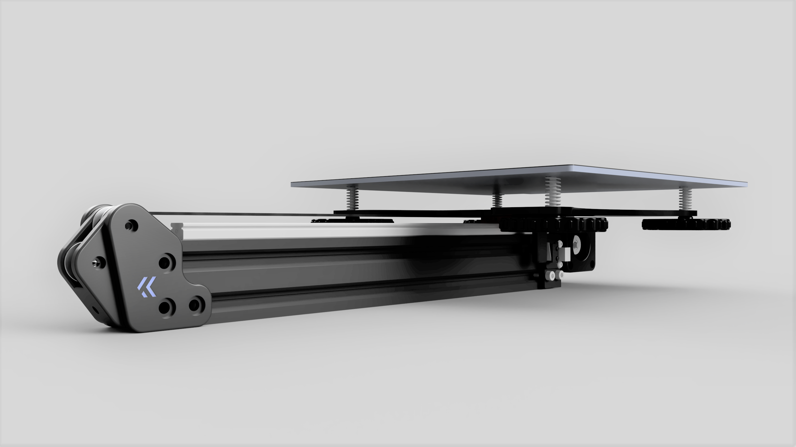
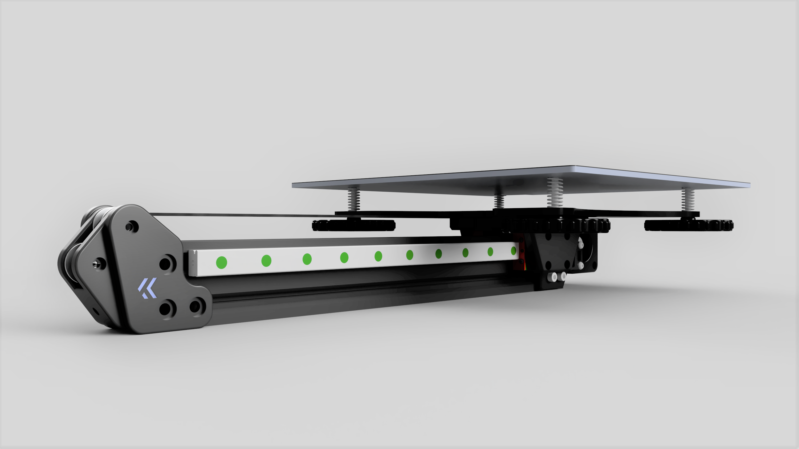
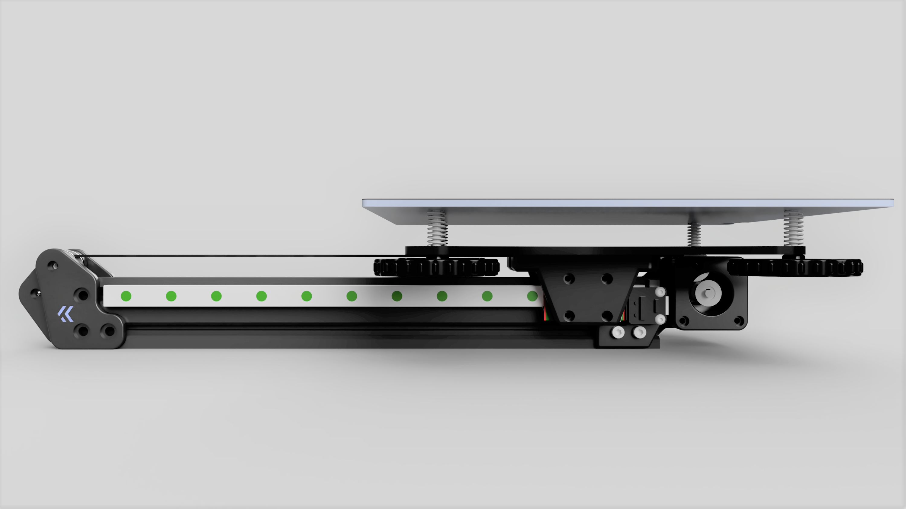
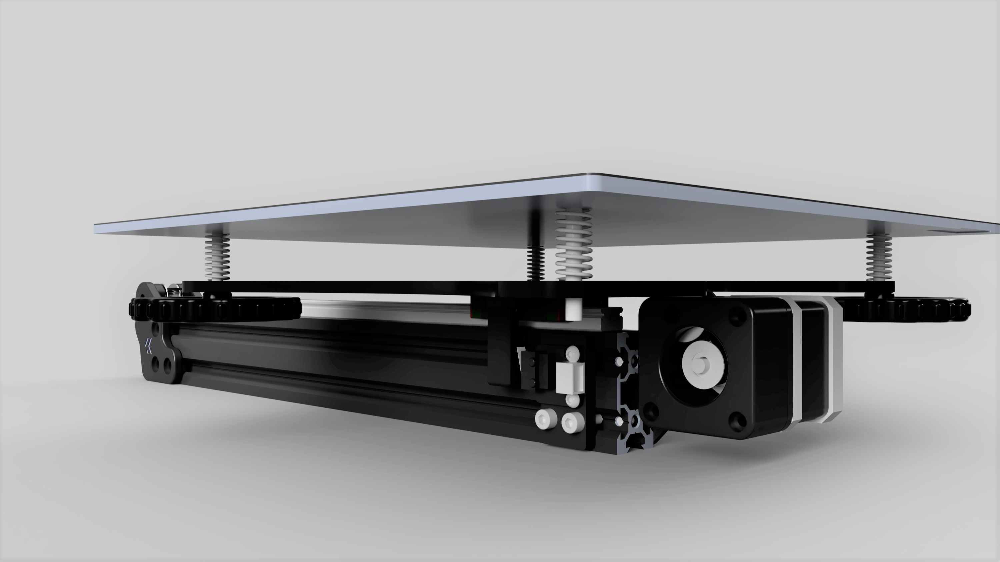
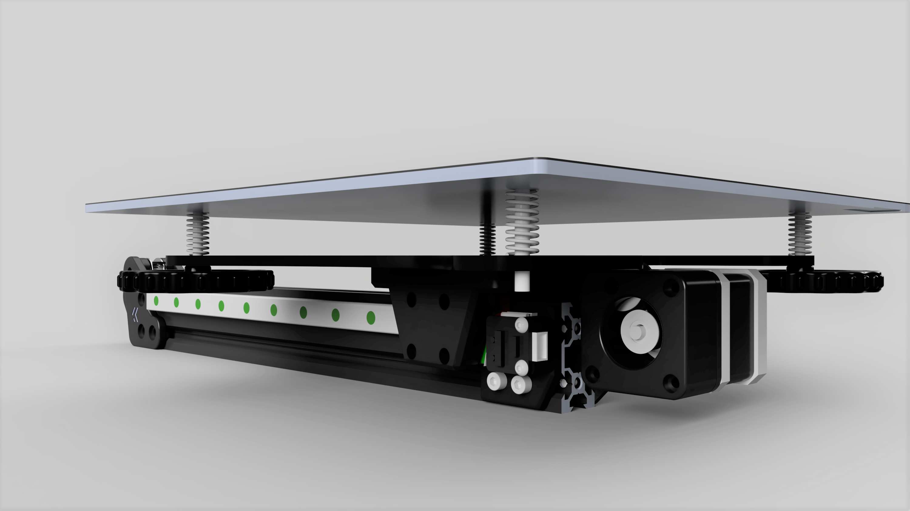

# Y Axis Linear Rail Mod for the Ender3
Upgrade your Ender 3 to a single or dual rail Y Axis. Ender 3 Pro and Ender 3 V2 will be supported later.

1: Single Rail        |  2: Dual Rail
:-------------------------:|:-------------------------:
  |  
  |  
  |  

## Why?
Just for fun, the Ender 3 prints very well even with the V Wheehls. The goal of this mod is not to reuse as many parts as possible from the Ender 3, but to create a very good working rail conversion for the Y axis. It includes parallel belt paths and a belt tensioner. All belts are guided by 20T idlers. The original metal motor plate of the Y-axis is reused to make everything as stable as possible.

## What?
There are two versions of the mod: Single Rail and Dual Rail. Both are compatible with each other, which means if you want to switch from single to dual (or the other way around), you don't have to reprint all the parts.

## How?
### Single Rail:
To attach the Single Rail to the Y Plate you need to drill 4 holes in it. I designed a drill guide that makes drilling very easy, even with a cordless screwdriver. Little pro tip: If the holes should be misaligned even with the drill guide, one, maximum two holes can be drilled out to 4mm. the other two holes align the Y Plate, and the two 4mm holes are used for additional attachment. The single rail version use an arm to reach the endstop. The endstop itself stays in the stock position with the stock braket.
### Dual Rail:
The Dual Rail version does not need to be drilled. Instead, a block is printed that attaches the two rails to the Y Plate. A total of 6 screws fix the Y Plate to the printed part. With the dual rail setup it is very important that both rails are parallel, otherwise it is very difficult to move the Y axis. See my video explaining how to align the rails (video coming soon). The dual rail version needs a new endstop braket.

## How to print?
All parts are already aligned in the optimal position for printing. Support is not needed. Use at least PETG or better ABS (+) to print the parts. My settings: 5 walls/top/bottom, 55% infill.

## What do I need to build it?
The BOM is still in progress.
